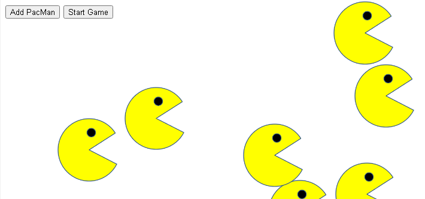

# Project Name
> PacMen Project

## Table of contents
* [General info](#general-info)
* [Screenshots](#screenshots)
* [Technologies](#technologies)
* [Setup](#setup)
* [Features](#features)
* [Status](#status)
* [Inspiration](#inspiration)
* [Contact](#contact)

## General info
This project was introduced to introduce multiple design issues:
*How can we produce many PacMen using the DOM?
*How can we keep track them using the DOM?
*How can we keep them on the screen?

We created a function that setup each instance of a PacMan. Each PacMan had a randomly generated starting point and velocity. I took those details and pushed them into an array. Then we used a forEach array loop to update the positons based on their velocities. I also was required to setup a function to create a boundary out of the top and bottom of the window, detect the collision with a PacMan, and send it the opposite way. After the project completed I have added styles to it, added the ability to make PacMan face the direction it is moving, and added animation we used in a previous PacMan project to have them open and close their mouthes. This project is still a work in progress, see below for a list of upcoming improvements and bug fixes.

## Screenshots

## Technologies
* HTML
* CSS
* JavaScript

## Setup
Feel free to fork it and make your own changes. You can also download the files to your local machine, unzip them into a folder, and play the game in your local browser. Or you can check out the project here (https://danielwestfall.github.io/pacmen/pacmen.html). 

Click the Add PacMan button to generate a PacMan who will travel at a random velocity. The Start Game button starts the motion! You can add more PacMen even after the game begins.

## Features
List of features ready:
* PacMan changes direction after hitting the walls.
* Add as many PacMen as you like.
* Hit the Start Game button and see them really fly!

To-do list:
* Add PacMan's friends and create collision detection between each character.
* Add Mrs.PacMan, Blinky, Pinky, Inky and Clyde.
* Detect collision between PacMen and friends.
* Turn the walls into a powerup for PacMan and Mrs. PacMan. When they turn back around they powerup and knock their foes out!

Known bugs:
* Mouth open/close animation freezes when there's an even number of PacMen on the screen.

## Status
Project is: _in progress_

Project done to class specifications. I have added code to make PacMen face the direction they are moving. I also added animation that makes PacMen open and close their mouthes. There is a known bug as when there are an even number of PacMen on the screen the animation breaks. This will be fixed in the future.

## Inspiration
Project created by MIT xPro Full Stack Web Development Course. Completed by Daniel Westfall.

## Contact
Created by [@danwestfall6](https://danielwestfall.github.io/) - feel free to contact me!

## License
MIT
