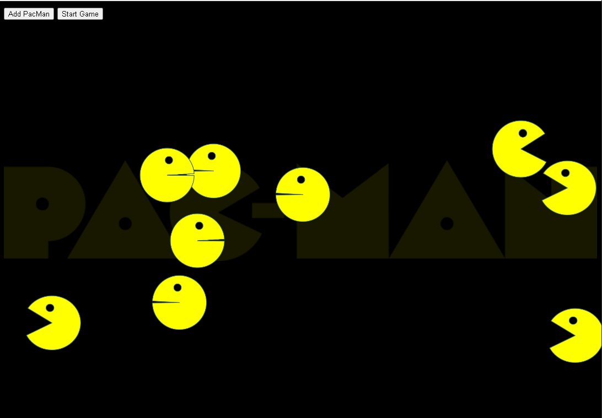

# Project Name
> PacMen Project

## Table of contents
* [General info](#general-info)
* [Screenshots](#screenshots)
* [Technologies](#technologies)
* [Setup](#setup)
* [Features](#features)
* [Status](#status)
* [Inspiration](#inspiration)
* [Contact](#contact)

## General info
Add more general information about project. What the purpose of the project is? Motivation?

## Screenshots

## Technologies
* HTML
* CSS
* JavaScript

## Setup
Feel free to fork it and make your own changes. Check out the project here (https://danielwestfall.github.io/pacmen/pacmen.html).

Click the Add PacMan to generate a PacMan who will travel at a random velocity. The Start Game button starts the motion! You can add more PacMen even after the game begins.

## Code Examples
Show examples of usage:
`put-your-code-here`

## Features
List of features ready and TODOs for future development
* Change PacMan direction after hitting the walls
* Add Blinky, Pinky, Inky and Clyde
* Detect collision between PacMen and friends

To-do list:
* Change image dynamically when PacMan hits the wall to be facing the correct direction
* Add PacMan's friends and create collision detection between each character

## Status
Project is: _in progress_

Project done to class specifications. I plan on making the game more complex.

## Inspiration
Project created by MIT xPro Full Stack Web Development Course. Completed by Daniel Westfall.

## Contact
Created by [@danwestfall6](https://danielwestfall.github.io/) - feel free to contact me!

## License
MIT
